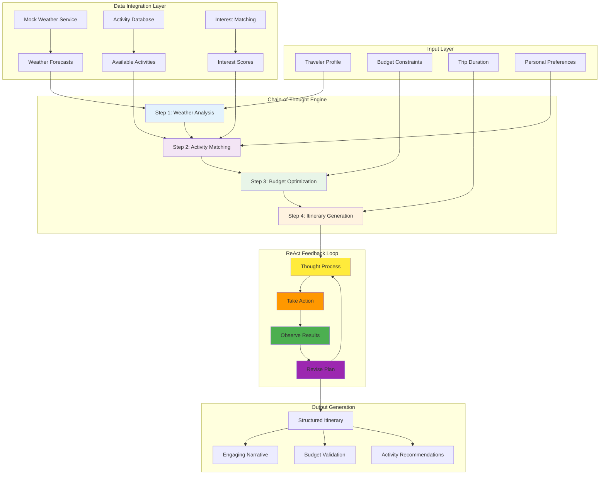
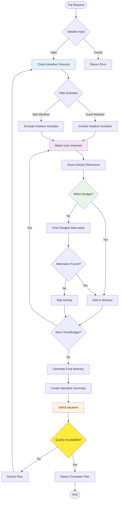
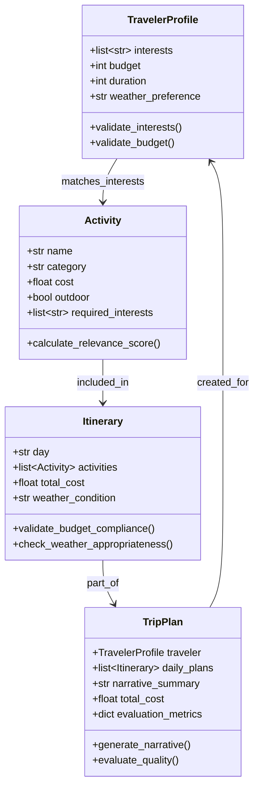
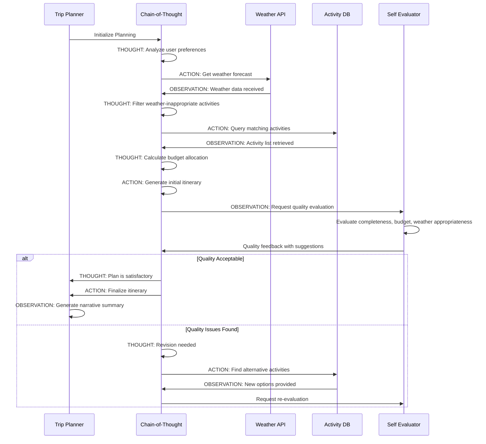

# AgentsVille Trip Planner - Advanced AI Architecture

## Chain-of-Thought & ReAct Processing Flow

## Intelligent Planning Algorithm

## Pydantic Data Validation Flow

## ReAct Pattern Implementation

