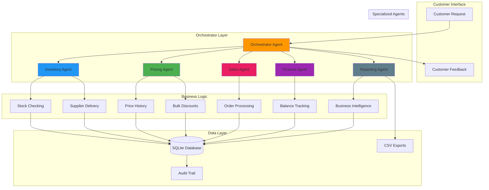
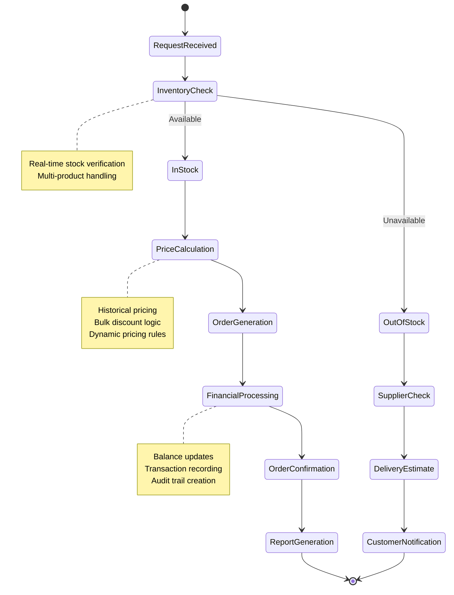
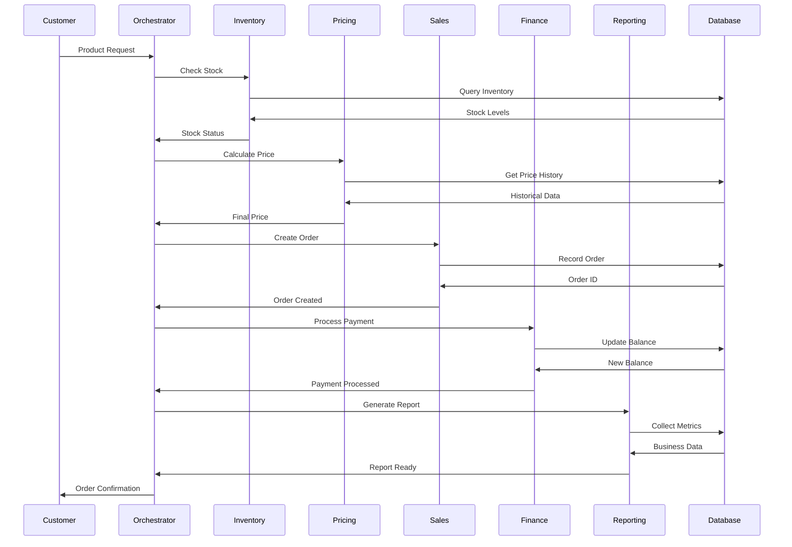

# Multi-Agent PaperSolution - B2B Automation Architecture

## Complete B2B Transaction Flow

```mermaid
graph TD
    subgraph "Customer Interface"
        CR[Customer Request]
        CF[Customer Feedback]
    end
    
    subgraph "Orchestrator Layer"
        ORCH[Orchestrator Agent]
        ORCH --> INV
        ORCH --> PRICE  
        ORCH --> SALES
        ORCH --> FIN
        ORCH --> REP
    end
    
    subgraph "Specialized Agents"
        INV[Inventory Agent]
        PRICE[Pricing Agent]
        SALES[Sales Agent]
        FIN[Finance Agent]
        REP[Reporting Agent]
    end
    
    subgraph "Data Layer"
        SQLITE[(SQLite Database)]
        CSV[CSV Exports]
        AUDIT[Audit Trail]
    end
    
    subgraph "Business Logic"
        STOCK[Stock Checking]
        SUPPLIER[Supplier Delivery]
        HISTORY[Price History]
        BULK[Bulk Discounts]
        ORDER[Order Processing]
        BALANCE[Balance Tracking]
        BI[Business Intelligence]
    end
    
    CR --> ORCH
    
    INV --> STOCK
    INV --> SUPPLIER
    STOCK --> SQLITE
    SUPPLIER --> SQLITE
    
    PRICE --> HISTORY
    PRICE --> BULK
    HISTORY --> SQLITE
    BULK --> SQLITE
    
    SALES --> ORDER
    ORDER --> SQLITE
    
    FIN --> BALANCE
    BALANCE --> SQLITE
    
    REP --> BI
    REP --> CSV
    BI --> SQLITE
    
    SQLITE --> AUDIT
    ORCH --> CF
    
    style ORCH fill:#ff9800
    style INV fill:#2196f3
    style PRICE fill:#4caf50
    style SALES fill:#e91e63
    style FIN fill:#9c27b0
    style REP fill:#607d8b
```

## Transaction Processing Workflow

```mermaid
stateDiagram-v2
    [*] --> RequestReceived
    RequestReceived --> InventoryCheck
    InventoryCheck --> InStock: Available
    InventoryCheck --> OutOfStock: Unavailable
    
    InStock --> PriceCalculation
    PriceCalculation --> OrderGeneration
    OrderGeneration --> FinancialProcessing
    FinancialProcessing --> OrderConfirmation
    OrderConfirmation --> ReportGeneration
    ReportGeneration --> [*]
    
    OutOfStock --> SupplierCheck
    SupplierCheck --> DeliveryEstimate
    DeliveryEstimate --> CustomerNotification
    CustomerNotification --> [*]
    
    note right of InventoryCheck
        Real-time stock verification
        Multi-product handling
    end note
    
    note right of PriceCalculation
        Historical pricing
        Bulk discount logic
        Dynamic pricing rules
    end note
    
    note right of FinancialProcessing
        Balance updates
        Transaction recording
        Audit trail creation
    end note
```

## Agent Communication Pattern

```mermaid
sequenceDiagram
    participant C as Customer
    participant O as Orchestrator
    participant I as Inventory
    participant P as Pricing  
    participant S as Sales
    participant F as Finance
    participant R as Reporting
    participant DB as Database
    
    C->>O: Product Request
    O->>I: Check Stock
    I->>DB: Query Inventory
    DB->>I: Stock Levels
    I->>O: Stock Status
    
    O->>P: Calculate Price
    P->>DB: Get Price History
    DB->>P: Historical Data
    P->>O: Final Price
    
    O->>S: Create Order
    S->>DB: Record Order
    DB->>S: Order ID
    S->>O: Order Created
    
    O->>F: Process Payment
    F->>DB: Update Balance
    DB->>F: New Balance
    F->>O: Payment Processed
    
    O->>R: Generate Report
    R->>DB: Collect Metrics
    DB->>R: Business Data
    R->>O: Report Ready
    
    O->>C: Order Confirmation
```
