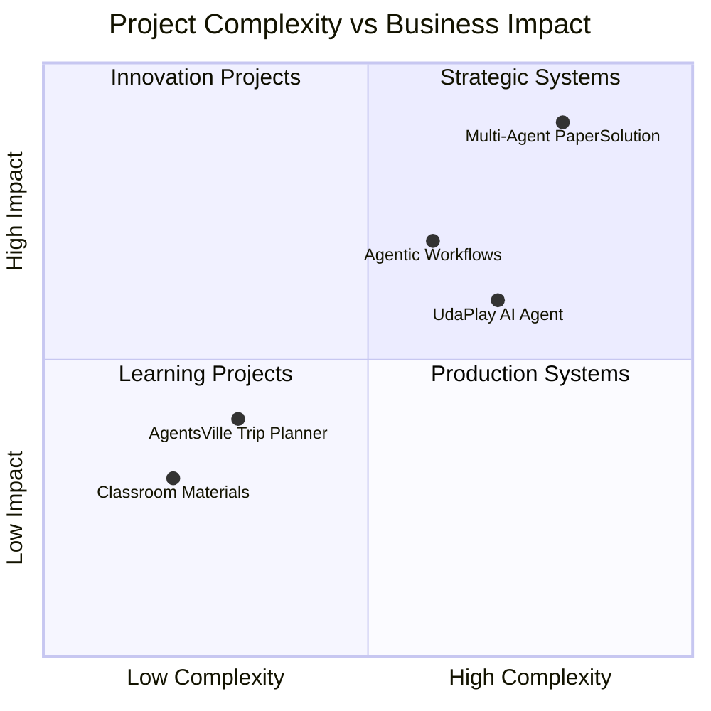
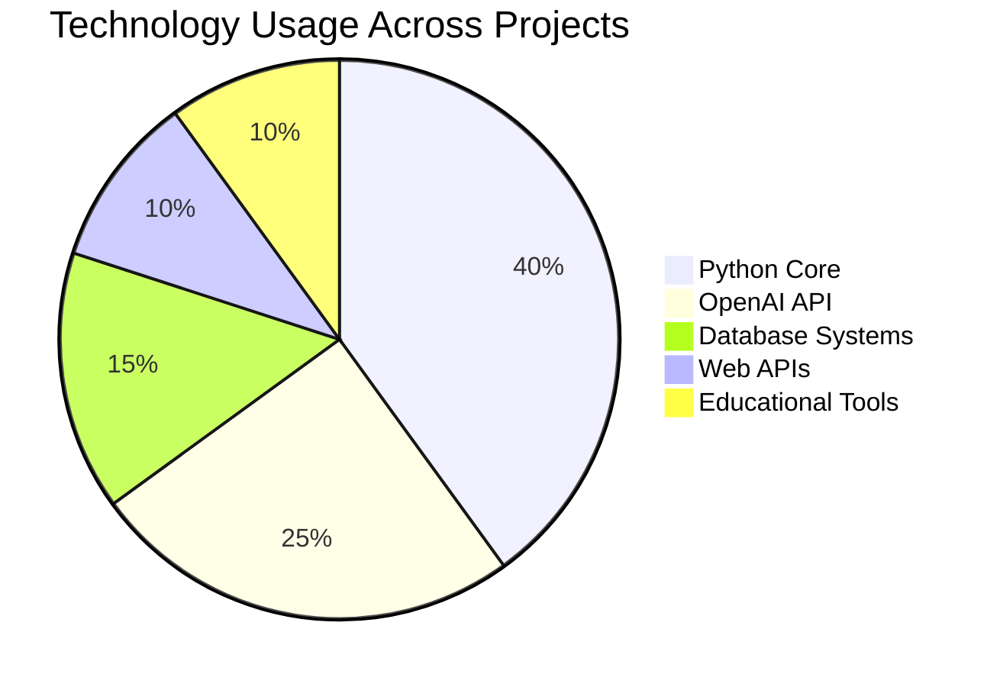
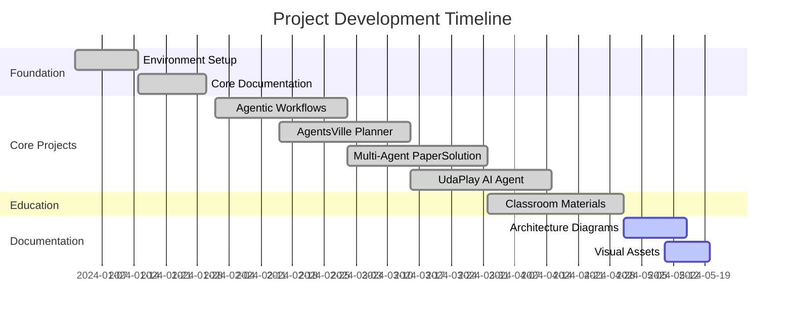

# Agentic AI Program - Repository Map

## Repository Structure Overview

```mermaid
graph TB
    subgraph "🤖 Agentic_AI_Program"
        direction TB
        
        ROOT[📁 Root Directory]
        DOCS[📁 docs/]
        ASSETS[📁 assets/]
        
        ROOT --> DOCS
        ROOT --> ASSETS
        ROOT --> P1
        ROOT --> P2
        ROOT --> P3
        ROOT --> P4
        ROOT --> P5
        
        subgraph "📊 Documentation & Assets"
            DOCS --> DOC_IMG[📁 images/]
            ASSETS --> HERO[🎨 hero-banner.png]
            DOC_IMG --> ARCH_DIAGRAMS[📄 Architecture Diagrams]
            ARCH_DIAGRAMS --> SYS_ARCH[system-architecture.md]
            ARCH_DIAGRAMS --> PAPER_ARCH[papersolution-architecture.md]
            ARCH_DIAGRAMS --> UDA_ARCH[udaplay-architecture.md]
            ARCH_DIAGRAMS --> REPO_MAP[repository-map.md]
        end
        
        subgraph "P1: 🏗️ Agentic-Workflows"
            P1_ROOT[📁 Agentic-Workflows/]
            P1_PHASE1[📁 phase_1/]
            P1_PHASE2[📁 phase_2/]
            P1_ENV[📁 agentic-wrkflow-env/]
            
            P1_ROOT --> P1_PHASE1
            P1_ROOT --> P1_PHASE2
            P1_ROOT --> P1_ENV
            
            P1_PHASE1 --> P1_AGENTS[📁 workflow_agents/]
            P1_PHASE1 --> P1_TESTS[📄 Agent Tests]
            P1_PHASE1 --> P1_OUTPUTS[📁 outputs/]
            
            P1_AGENTS --> P1_BASE[📄 base_agents.py]
            P1_PHASE2 --> P1_WORKFLOW[📄 agentic_workflow.py]
            P1_PHASE2 --> P1_KNOWLEDGE[📄 knowledge_and_personas.py]
        end
        
        subgraph "P2: 🧠 AgentsVille-Trip-Planner"
            P2_ROOT[📁 AgentsVille-Trip-Planner/]
            P2_NOTEBOOK[📓 AgentsVille.ipynb]
            P2_ENV[📁 agentsville-env/]
            P2_DATA[📁 data/]
            
            P2_ROOT --> P2_NOTEBOOK
            P2_ROOT --> P2_ENV
            P2_ROOT --> P2_DATA
            
            P2_DATA --> P2_ACTIVITIES[📄 activities.json]
            P2_DATA --> P2_WEATHER[📄 weather_data.json]
        end
        
        subgraph "P3: 💼 Multi-Agent-PaperSolution"
            P3_ROOT[📁 Multi-Agent-PaperSolution/]
            P3_STARTER[📄 project_starter.py]
            P3_CSV[📄 CSV Files]
            P3_PDF[📄 beaver_agent_workflow.pdf]
            
            P3_ROOT --> P3_STARTER
            P3_ROOT --> P3_CSV
            P3_ROOT --> P3_PDF
            
            P3_CSV --> P3_QUOTES[📄 quotes.csv]
            P3_CSV --> P3_REQUESTS[📄 quote_requests.csv]
            P3_CSV --> P3_RESULTS[📄 test_results.csv]
        end
        
        subgraph "P4: 🎮 udaplay-ai-agent"
            P4_ROOT[📁 udaplay-ai-agent/]
            P4_LIB[📁 lib/]
            P4_DATA[📁 data/]
            P4_MAIN[📄 main.py]
            
            P4_ROOT --> P4_LIB
            P4_ROOT --> P4_DATA
            P4_ROOT --> P4_MAIN
            
            P4_LIB --> P4_AGENT[📄 udaplay_agent.py]
            P4_LIB --> P4_STATE[📄 state_machine.py]
            P4_LIB --> P4_TOOLS[📄 tools.py]
            
            P4_DATA --> P4_GAMES[📄 15 Game Files]
            P4_GAMES --> P4_JSON[📄 game_*.json]
        end
        
        subgraph "P5: 📚 cd14525-agentic-workflows-classroom"
            P5_ROOT[📁 cd14525-agentic-workflows-classroom/]
            P5_LESSONS[📁 lessons/]
            P5_FRAMEWORKS[📁 frameworks/]
            P5_TEMPLATES[📁 templates/]
            
            P5_ROOT --> P5_LESSONS
            P5_ROOT --> P5_FRAMEWORKS
            P5_ROOT --> P5_TEMPLATES
            
            P5_LESSONS --> P5_L1[📄 01-introduction/]
            P5_LESSONS --> P5_L2[📄 02-understanding-agents/]
            P5_LESSONS --> P5_L10[📄 10-overview/]
            
            P5_FRAMEWORKS --> P5_AUTOGPT[📁 autogpt/]
            P5_FRAMEWORKS --> P5_AUTOGEN[📁 autogen/]
            P5_FRAMEWORKS --> P5_CREWAI[📁 crewai/]
        end
        
        ROOT --> README[📄 README.md]
        ROOT --> QUICK[📄 QUICK_START.md]
        ROOT --> OUTLINE[📄 README_OUTLINE.md]
        ROOT --> AUDIT[📄 Project_Audit_Notes.md]
        ROOT --> GITMODULES[📄 .gitmodules]
    end
    
    style P1_ROOT fill:#e1f5fe
    style P2_ROOT fill:#f3e5f5
    style P3_ROOT fill:#e8f5e8
    style P4_ROOT fill:#fff3e0
    style P5_ROOT fill:#fce4ec
    style DOCS fill:#f5f5f5
    style ASSETS fill:#f0f0f0
```

## Project Categorization Matrix

```mermaid
quadrantChart
    title Project Complexity vs Business Impact
    x-axis Low Complexity --> High Complexity
    y-axis Low Impact --> High Impact
    
    quadrant-1 Strategic Systems
    quadrant-2 Innovation Projects
    quadrant-3 Learning Projects
    quadrant-4 Production Systems
    
    AgentsVille Trip Planner: [0.3, 0.4]
    Classroom Materials: [0.2, 0.3]
    Agentic Workflows: [0.6, 0.7]
    UdaPlay AI Agent: [0.7, 0.6]
    Multi-Agent PaperSolution: [0.8, 0.9]
```

## Technology Stack Distribution

```mermaid
pie title Technology Usage Across Projects
    "Python Core" : 40
    "OpenAI API" : 25
    "Database Systems" : 15
    "Web APIs" : 10
    "Educational Tools" : 10
```

## Development Timeline

```mermaid
gantt
    title Project Development Timeline
    dateFormat  YYYY-MM-DD
    section Foundation
    Environment Setup    :done, setup, 2024-01-01, 2024-01-15
    Core Documentation  :done, docs, 2024-01-15, 2024-01-30
    
    section Core Projects
    Agentic Workflows   :done, aw, 2024-02-01, 2024-03-01
    AgentsVille Planner :done, av, 2024-02-15, 2024-03-15
    Multi-Agent PaperSolution :done, map, 2024-03-01, 2024-04-01
    UdaPlay AI Agent    :done, uda, 2024-03-15, 2024-04-15
    
    section Education
    Classroom Materials :done, edu, 2024-04-01, 2024-05-01
    
    section Documentation
    Architecture Diagrams :active, arch, 2024-05-01, 2024-05-15
    Visual Assets       :active, visual, 2024-05-10, 2024-05-20
```
