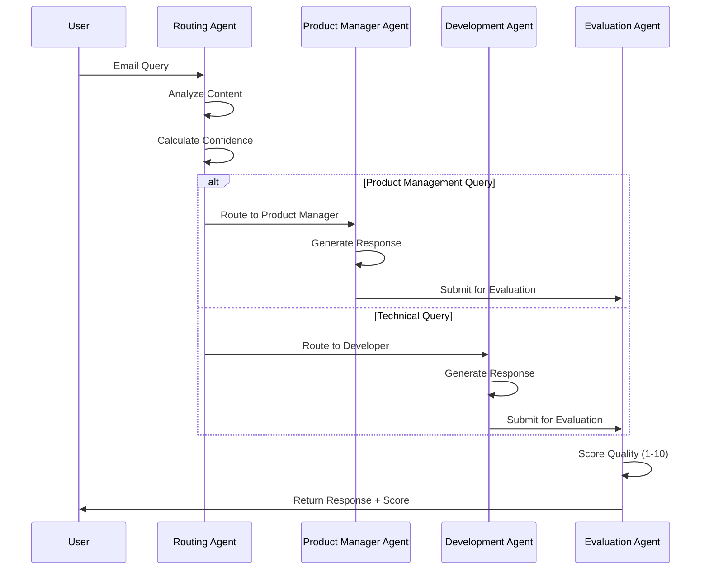

# Agentic AI Program - System Architecture

## Overall Portfolio Architecture

```mermaid
graph TB
    subgraph "Agentic AI Program Portfolio"
        direction TB
        
        subgraph "Core Infrastructure"
            ENV[Environment Management]
            API[API Integration Layer]
            DB[(Data Persistence)]
        end
        
        subgraph "Project 1: Agentic Workflows"
            AW_AGENTS[7 Agent Types]
            AW_ROUTER[Email Router]
            AW_EVAL[Quality Evaluation]
            
            AW_AGENTS --> AW_ROUTER
            AW_ROUTER --> AW_EVAL
        end
        
        subgraph "Project 2: AgentsVille Trip Planner" 
            AV_WEATHER[Weather API]
            AV_COT[Chain-of-Thought Engine]
            AV_REACT[ReAct Feedback Loop]
            
            AV_WEATHER --> AV_COT
            AV_COT --> AV_REACT
        end
        
        subgraph "Project 3: Multi-Agent PaperSolution"
            MAP_ORCH[Orchestrator Agent]
            MAP_INV[Inventory Agent]
            MAP_PRICE[Pricing Agent]
            MAP_SALES[Sales Agent]
            MAP_FIN[Finance Agent]
            MAP_REP[Reporting Agent]
            
            MAP_ORCH --> MAP_INV
            MAP_ORCH --> MAP_PRICE
            MAP_ORCH --> MAP_SALES
            MAP_ORCH --> MAP_FIN
            MAP_ORCH --> MAP_REP
        end
        
        subgraph "Project 4: UdaPlay AI Agent"
            UP_STATE[State Machine]
            UP_RAG[RAG Knowledge Base]
            UP_WEB[Web Search]
            UP_ROUTE[Intelligent Routing]
            
            UP_STATE --> UP_ROUTE
            UP_ROUTE --> UP_RAG
            UP_ROUTE --> UP_WEB
        end
        
        subgraph "Project 5: Classroom Materials"
            EDU_CURR[10-Lesson Curriculum]
            EDU_FRAME[Framework Examples]
            EDU_TEMP[Template System]
            
            EDU_CURR --> EDU_FRAME
            EDU_FRAME --> EDU_TEMP
        end
        
        ENV --> AW_AGENTS
        ENV --> AV_COT
        ENV --> MAP_ORCH
        ENV --> UP_STATE
        ENV --> EDU_CURR
        
        API --> AW_ROUTER
        API --> AV_WEATHER
        API --> MAP_ORCH
        API --> UP_RAG
        
        DB --> MAP_FIN
        DB --> UP_RAG
        
    end
    
    subgraph "External Services"
        OPENAI[OpenAI GPT-4]
        TAVILY[Tavily Search API]
        WEATHER[Weather APIs]
        CHROMA[(ChromaDB)]
        SQLITE[(SQLite)]
    end
    
    API --> OPENAI
    API --> TAVILY
    API --> WEATHER
    DB --> CHROMA
    DB --> SQLITE
    
    style AW_AGENTS fill:#e1f5fe
    style AV_COT fill:#f3e5f5
    style MAP_ORCH fill:#e8f5e8
    style UP_STATE fill:#fff3e0
    style EDU_CURR fill:#fce4ec
```

## Agent Interaction Flow

```mermaid
sequenceDiagram
    participant User
    participant Router as Routing Agent
    participant PM as Product Manager Agent
    participant Dev as Development Agent
    participant Eval as Evaluation Agent
    
    User->>Router: Email Query
    Router->>Router: Analyze Content
    Router->>Router: Calculate Confidence
    
    alt Product Management Query
        Router->>PM: Route to Product Manager
        PM->>PM: Generate Response
        PM->>Eval: Submit for Evaluation
    else Technical Query
        Router->>Dev: Route to Developer
        Dev->>Dev: Generate Response
        Dev->>Eval: Submit for Evaluation
    end
    
    Eval->>Eval: Score Quality (1-10)
    Eval->>User: Return Response + Score
```
