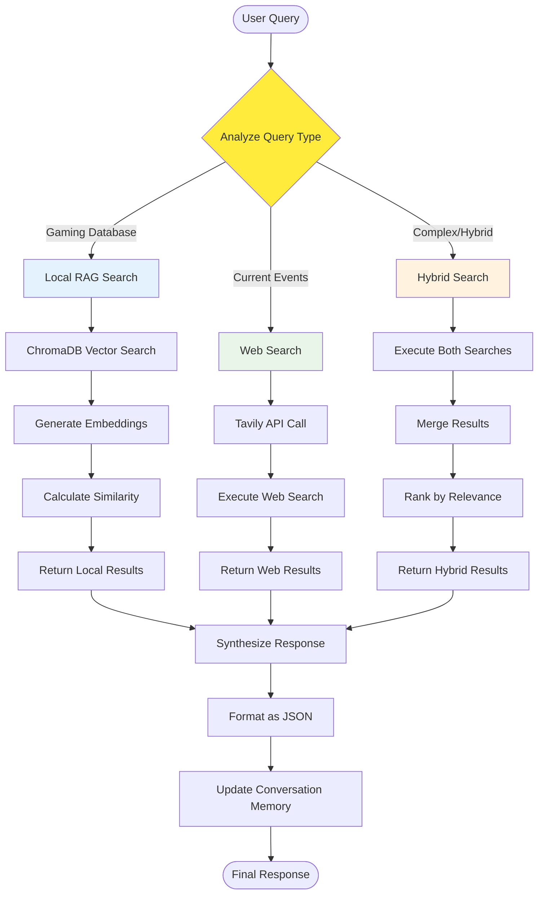
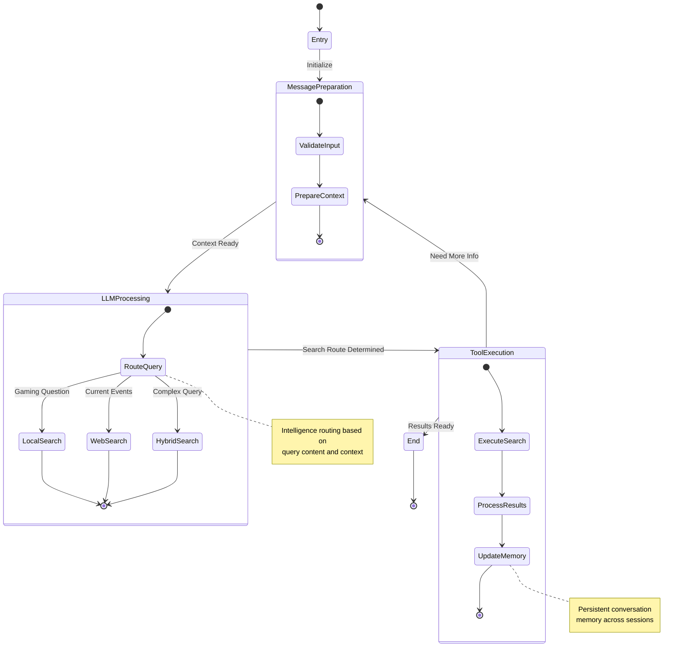

# UdaPlay AI Agent - Hybrid RAG Architecture

## Intelligent Knowledge Routing System

```mermaid
graph TB
    subgraph "User Interface"
        USER[User Query]
        RESPONSE[Structured Response]
    end
    
    subgraph "State Machine Core"
        ENTRY[Entry State]
        MSG_PREP[Message Preparation]
        LLM_PROC[LLM Processing]
        TOOL_EXEC[Tool Execution]
        END_STATE[End State]
        
        ENTRY --> MSG_PREP
        MSG_PREP --> LLM_PROC
        LLM_PROC --> TOOL_EXEC
        TOOL_EXEC --> END_STATE
        TOOL_EXEC --> MSG_PREP
    end
    
    subgraph "Intelligence Layer"
        ROUTER[Query Router]
        CONTEXT[Context Manager]
        MEMORY[Conversation Memory]
        
        ROUTER --> CONTEXT
        CONTEXT --> MEMORY
    end
    
    subgraph "Knowledge Sources"
        direction LR
        
        subgraph "Local RAG System"
            CHROMA[(ChromaDB)]
            EMBEDDINGS[Vector Embeddings]
            SEMANTIC[Semantic Search]
            
            CHROMA --> EMBEDDINGS
            EMBEDDINGS --> SEMANTIC
        end
        
        subgraph "Web Search System"
            TAVILY[Tavily API]
            WEB_SEARCH[Real-time Search]
            LIVE_DATA[Live Information]
            
            TAVILY --> WEB_SEARCH
            WEB_SEARCH --> LIVE_DATA
        end
    end
    
    subgraph "Data Sources"
        GAME_DB[15 Game Files]
        JSON_META[JSON Metadata]
        GAME_INFO[Game Information]
        
        GAME_DB --> JSON_META
        JSON_META --> GAME_INFO
    end
    
    USER --> ENTRY
    LLM_PROC --> ROUTER
    
    ROUTER --> SEMANTIC: Local Knowledge
    ROUTER --> WEB_SEARCH: External Info
    
    GAME_INFO --> CHROMA
    SEMANTIC --> CONTEXT
    LIVE_DATA --> CONTEXT
    
    CONTEXT --> RESPONSE
    END_STATE --> RESPONSE
    RESPONSE --> USER
    
    style ROUTER fill:#ff9800
    style SEMANTIC fill:#2196f3
    style WEB_SEARCH fill:#4caf50
    style CHROMA fill:#9c27b0
    style TAVILY fill:#f44336
```

## Query Processing Decision Tree



## State Machine Workflow


